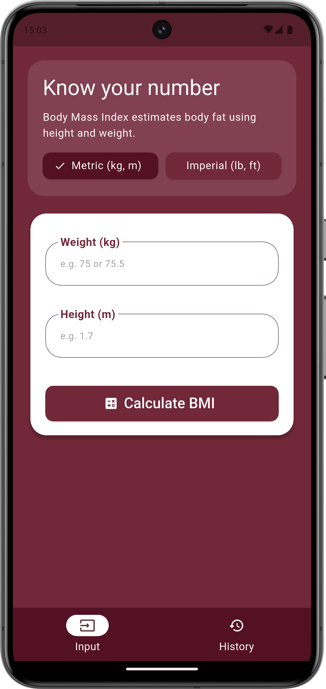
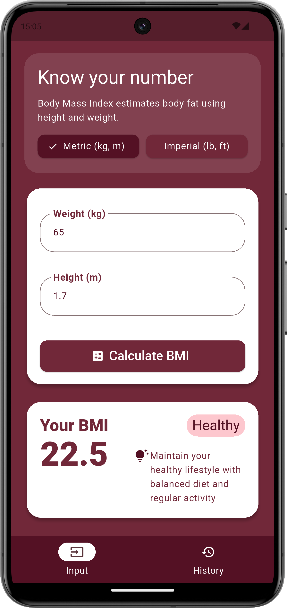
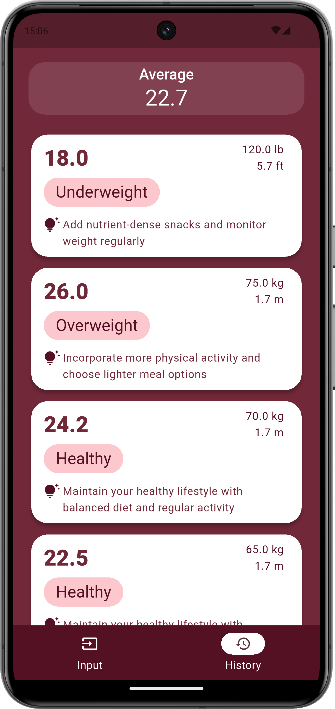
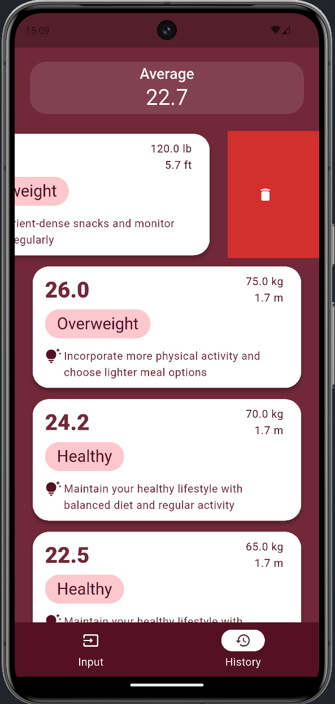

# 🧮 BMI Calculator — Flutter + Clean Architecture + Riverpod

A Flutter application built with clean architecture and Riverpod for state management. This BMI (Body Mass Index) calculator allows users to input their data, view results, and track a history of previous calculations — all within a sleek, responsive interface.

## ✨ Features

- **Main input screen** for entering weight and height  
- **Support for metric and imperial units** (kg/m and lb/ft)  
- **Result widget** displaying BMI value, classification and tip  
- **History screen** showing previous calculations in a dismissible list  
- **State management** with Riverpod for modular and reactive design  
- **Clean architecture** separating domain, data, and presentation layers  
- **Custom light theme** with defined color palette and consistent UI styling  

## 🎯 Purpose

This project aims to provide a solid foundation for scalable Flutter applications by demonstrating best practices in architecture and state management. It delivers a simple and intuitive user experience while maintaining a clean and maintainable codebase.

## 📸 Screenshots

<table>
  <tr>
    <td>
      <strong>Input Page — No Result</strong><br><br>
      
    </td>
    <td>
      <strong>Input Page — With Result</strong><br><br>
      
    </td>
  </tr>
  <tr>
    <td>
      <strong>History Page — With Results</strong><br><br>
      
    </td>
    <td>
      <strong>History Page — Result Being Dragged</strong><br><br>
      
    </td>
  </tr>
</table>


## 📁 Project Structure

```text
lib/
├── config/                      # App-wide configuration
│   ├── colors/                   # Centralized color definitions
│   ├── themes/                   # Light and dark themes setup and styling
│   └── constants.dart            # Global constants used across the app
│
├── core/                        # Shared utilities and components
│   ├── routes/                   # Route definitions
│   └── widgets/                  # Reusable UI widgets (e.g., buttons, cards)
│
├── features/
│   └── bmi/                     # BMI feature module
│       ├── application/          # Business logic helpers
│       │   ├── formatters/       # Input formatters (e.g., number formatting hints)
│       │   └── validators/       # Input validation logic
│       │
│       ├── data/                # Data layer
│       │   ├── data_sources/     # local storage
│       │   ├── models/           # Data models
│       │   └── repositories/     # Concrete implementations of data access
│       │
│       ├── domain/              # Domain layer (pure business logic)
│       │   ├── entities/         # Core domain models (e.g., BMIResult)
│       │   ├── repositories/     # Abstract repository interfaces
│       │   └── use_cases/        # Application-specific business rules
│       │
│       └── presentation/        # UI layer
│           ├── pages/            # Screens like input and history
│           ├── riverpod/         # Riverpod providers and state logic
│           └── widgets/          # Feature-specific UI components
```
This structure is clean, scalable, and follows best practices for modular Flutter development. If you want, I can help you generate documentation for each layer or even create a diagram to visualize the architecture. Just say the word!


